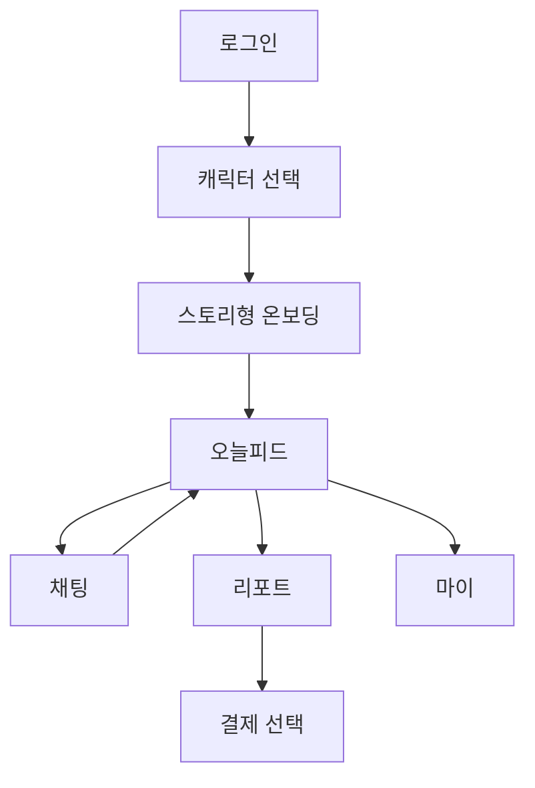

# 월간사주 사용자 플로우

```mermaid
flowchart TD
  A[로그인] --> B[캐릭터 선택]
  B --> C[스토리형 온보딩]
  C --> D[오늘피드]
  D --> E[채팅]
  D --> F[리포트]
  E --> D
  F --> G[결제 선택]
  D --> H[마이]
```

## 주요 플로우
- 신규 사용자는 캐릭터를 먼저 선택한다.
- 캐릭터는 스토리형 온보딩에서 생년월일과 관심사를 받는다.
- 오늘피드에서 행동카드와 시간대별 타임라인을 확인한다.
- 사용자는 채팅으로 더 묻거나 리포트로 깊게 읽는다.
- 무료 할당량이 끝나면 단품과 구독 결제 선택지를 본다.

